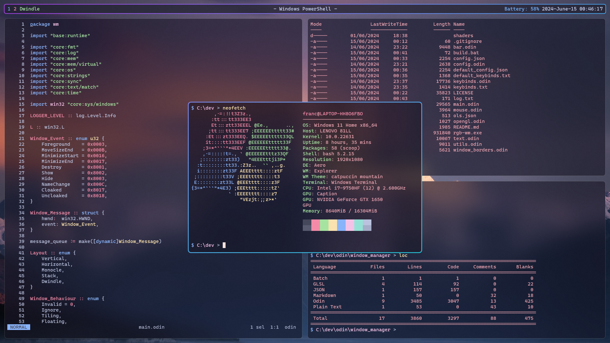

Warning: This is a small and young toy project, it might eat your windows

Warning: At the moment multi monitor setups are _not_ supported
# RGB WM
RGB WM is a dynamic tiling window manager for Windows 11 that does not sacrifice on its RGB

Floating windows can be dragged when holding alt and pressing LMB, resized with RMB or centered with MMB.

## Installation

### Prebuilt binaries
Prebuilt binaries are available in the releases

### Build from source
You need to have the Odin compiler installed on your system
1. Clone the repo
2. `$ ./build.bat`

## Configuration
Both configuration files have to be located next to RGB WM executable, wich will probably change at some point

If a configuration file is missing a default one will be generated

### Keybinds
Keybinds are configured within keybinds.txt

The format is "Modifiers + Key : Command"

The names of the keys mostly follow Microsofts Virtual Keycodes

Everything is case insensitive

### Config
Window Borders, the Bar, Workspaces etc are configured in config.json

NOTE: Some options may require a restart, this will be fixed at some point

Window Rules are matched based on class and/or title of the window. The rule gets applied if both match one of the specified titles/classes.

If title or class is empty it will match any window matching the other criterium.

You can set the behaviour of the window to Floating, Tiling or Ignore.

You can also remove the titlebar of a window by setting `remove_title_bar` to true.

You can also specify a border offset by setting the border field to a rectangle with `left`, `right`, `top` and `bottom` fields, to position borders adequately on weird windows.

# Alternatives
These are some fantastic window managers for windows that served as inspirations, learning materials and alternatives to this one, go check them out they are all quite nice (none of them have RGB tho)
- [GlazeWM](https://github.com/glzr-io/glazewm)
- [Komorebi](https://github.com/LGUG2Z/komorebi)
- [dwm-win32](https://github.com/prabirshrestha/dwm-win32)
